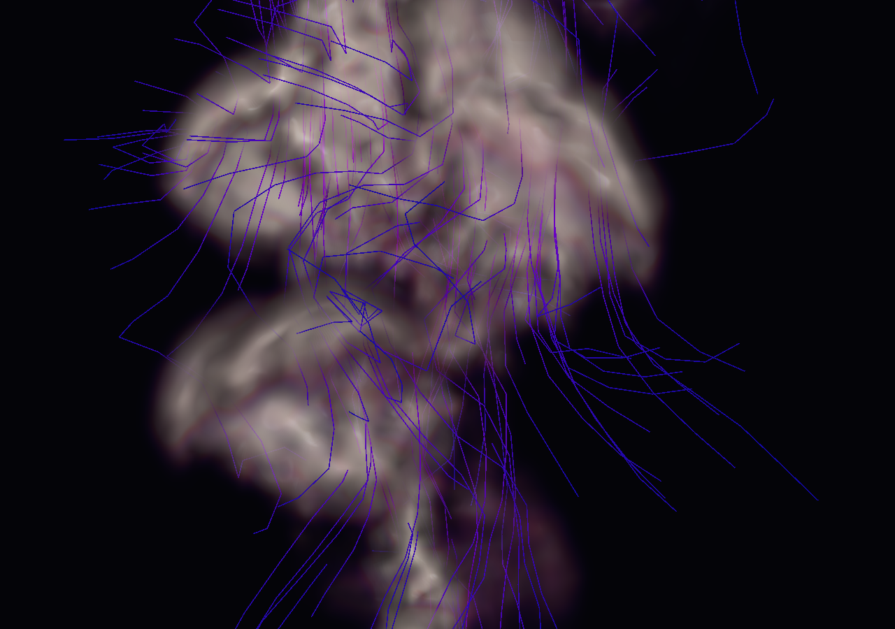
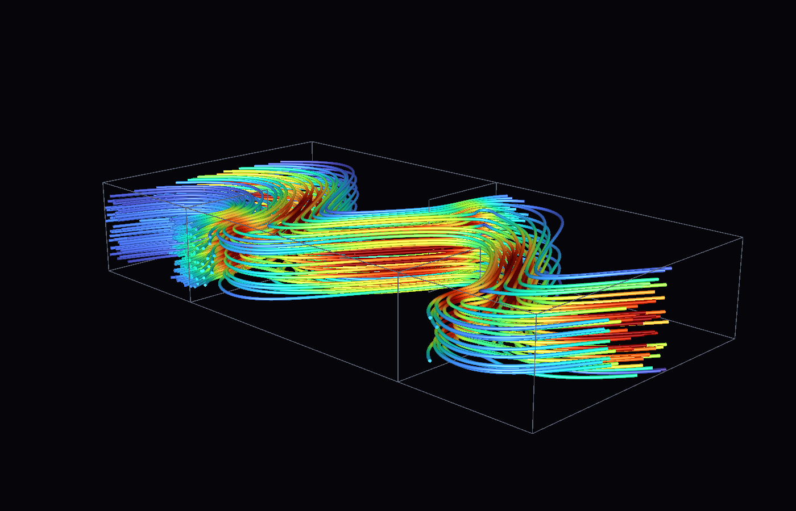
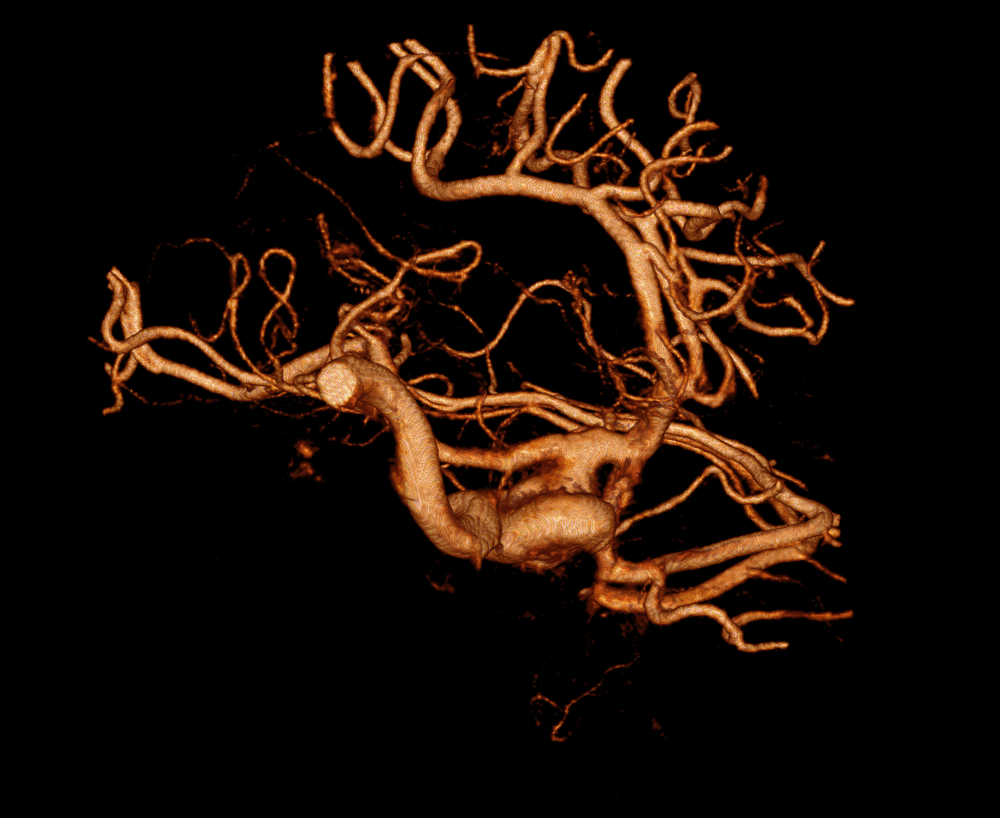
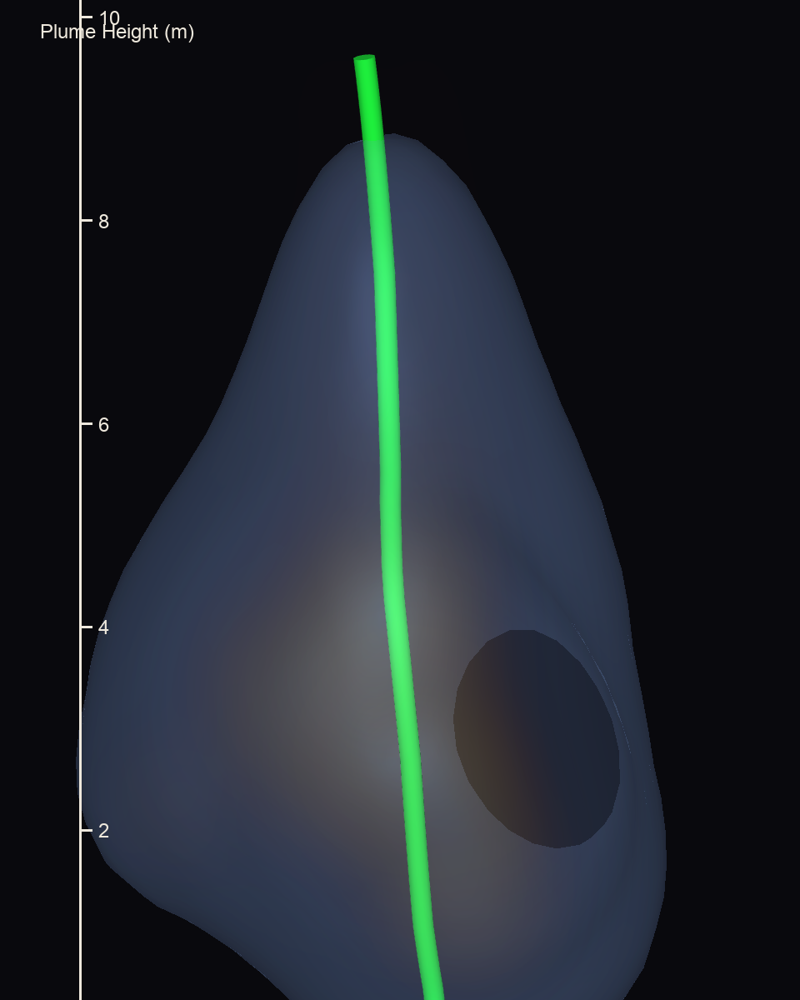
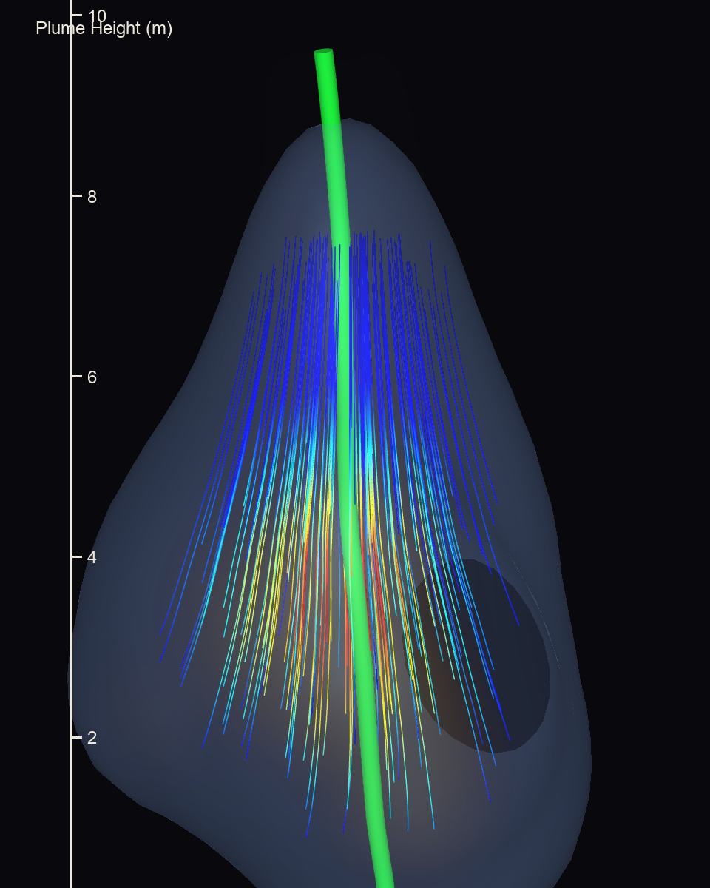
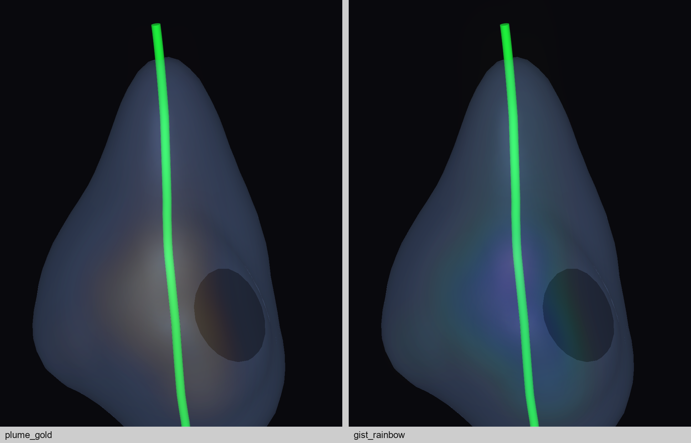

# PyViz4D

Scientific and spatio-temporal (4-D) visualization built directly on **VTK** —
no PyVista. Time-varying actors, volume rendering, streamlines, CityJSON city
models, Earth textures, and a small palette of primitives for drawing lines,
points and spherical voxels.



## Installation

The core install is deliberately small — `vtk` + `numpy` + `matplotlib`, enough
to draw wireframes, voxel cages and points and to write offscreen PNGs:

```bash
uv pip install pyviz4d
```

Everything heavier (Earth textures, CityJSON/CRS, video recording, PhiFlow) is
imported lazily and therefore lives behind extras. Ask for only what you use:

| Extra | Pulls in | Unlocks |
| --- | --- | --- |
| `earth` | `pooch` | `pyviz4d.earth` (textures, `WGS84`) and `EarthViewer4D` |
| `geo` | `pooch`, `pyproj`, `requests`, `imageio` | `read_cityjson()`, `examples/demo_cityjson.py`, the `demo_lod1_*` generators |
| `video` | `imageio`, `imageio[ffmpeg]` | `Viewer4D.enable_recording()` — `frames_dir` needs plain `imageio`, `video_path` needs ffmpeg |
| `all` | all four leaves | everything except the PhiFlow demo |
| `phiflow` | `phiflow`, `scipy`, `tqdm`, `jax` | `examples/demo_phiflow.py` |
| `dev` | `pytest` + the four leaves | running `tests/` |

```bash
uv pip install "pyviz4d[all]"      # or [earth], [geo], [video]
```

`matplotlib` stays in the core set because `primitives.get_color`,
`volume.matplotlib_ctf` and `streamline` import it at module level.

## Quick start

```python
import numpy as np
from pyviz4d import Viewer4D, line_actor, point_actor, render_to_png

xyz = np.array([[0, 0, 0], [1, 0, 0], [0, 1, 0], [0, 0, 1]], float)
wire = line_actor(xyz, xyz + 1.0)          # one cell per pair, cyan by default
dots = point_actor(xyz, size=8.0)          # `size` is a glyph radius in world units

render_to_png([wire, dots], "scene.png", size=(1200, 900))   # offscreen, no display

viewer = Viewer4D(size=(1200, 900))
viewer.add_actor(wire)
viewer.add_actor(dots)
viewer.save_screenshot("shot.png", scale=2)  # works without start(); scale=2 doubles pixels
viewer.start()                             # blocks in the interactor loop
```

`render_to_png` creates its own renderer and offscreen window, so a one-shot
PNG needs no interactor. Note that it ends with `ResetCamera()`, which reframes
the supplied `camera=` to fit the scene and cancels any pre-applied `Zoom()` —
only the view direction, focal point and view-up survive, so aim the camera
rather than positioning it at a chosen radius.

## Coordinate convention

Every angular helper uses **latitude**, not colatitude:

```
x = r cos(theta) cos(phi)     y = r cos(theta) sin(phi)     z = r sin(theta)
```

with `theta` in `[-pi/2, +pi/2]`. This matches `pyviz4d.earth` (WGS84
conversions) and `pyviz4d.spherical_grid`, which is used by
`examples/demo_4d.py`. There is intentionally **no colatitude helper** anywhere
in the package: the same name with the opposite convention is the failure mode
this codebase is written to avoid.

## API at a glance

| Module | Contents |
| --- | --- |
| `pyviz4d.primitives` | `get_color`, `line_source`, `line_actor`, `point_actor`, `spherical_voxel_actor`, `render_to_png`, `viewpoint` |
| `pyviz4d.viz` | `Viewer4D` (`add_actor`, `start`, `enable_recording`, `save_screenshot`), `EarthViewer4D`, `TemporalActor` |
| `pyviz4d.volume` | `VolumeActor`, `IsosurfaceActor`, `contour_actor`, `matplotlib_ctf`, `power_opacity`, `create_vtk_image_from_numpy` |
| `pyviz4d.streamline` | `StreamlineActor`, `CenterlineActor`, `trace_streamlines`, `apply_tracer_settings`, `gradient_field`, `vector_field_to_vtk`, `extract_centerline`, `centerline_seeds`, `polydata_from_points` |
| `pyviz4d.series` / `pyviz4d.io` | `IsosurfaceSeriesActor`, `PolyDataSeriesActor`, `VTKSeriesWriter`, `parse_pvd` |
| `pyviz4d.cityjson` | `read_cityjson` |
| `pyviz4d.earth` | `earth_actor`, `WGS84`, `blue_marble.fetch` |

Everything in this table except the dotted `blue_marble.fetch` is re-exported
at the top level, so `from pyviz4d import line_actor` works; the same names are
also reachable as `pyviz4d.primitives.line_actor` and so on.

## Examples

```bash
uv sync --extra all          # once; or --extra dev for the test suite
```

| Example | What it shows |
| --- | --- |
| `demo_4d.py` | Earth texture with a time animation |
| `demo_grid.py` | Multi-view grid with linked camera and time (`--nrows`, `--ncols`) |
| `demo_cityjson.py` | Reading a CityJSON city model |
| `demo_decoupled_pipeline.py` | Writing a VTK time series, then lazy-loading it |
| `demo_phiflow.py` | A **4-D simulation**: buoyant smoke plume, integrated in PhiFlow and ray-cast as fire (below) |
| `demo_plumeviz.py` | COVIS hydrothermal plume: volume rendering + streamlines |
| `demo_plumeviz_fig3.py` | Paper-faithful static figures (`--mode`) |
| `validate_wgs84.py` | WGS84 conversion checks |
| `demo_lod1_*.py` | LoD1 city models from OpenStreetMap and Open City Model (below) |

Every demo opens an interactive window (left-drag rotate, middle/shift-drag pan,
scroll zoom, `q` quit) except `demo_plumeviz_fig3.py`, whose `--mode` runs and the
`demo_lod1_*` generators write files instead. Each command carries whatever that
script needs beyond the core install: `--extra` for a declared extra, `--with`
for the few light packages no extra declares.

```bash
uv run --extra earth python examples/demo_4d.py                      # Earth + animation
uv run python examples/demo_grid.py --nrows 1 --ncols 2              # linked multi-view
uv run --extra geo python examples/demo_cityjson.py                  # CityJSON city model
uv run --with tqdm python examples/demo_decoupled_pipeline.py        # write + lazy-load series
uv run --extra phiflow python examples/demo_phiflow.py               # 4-D smoke plume (simulated + ray-cast)
uv run --with scipy python examples/demo_plumeviz.py                 # COVIS volume + streamlines
uv run --with scipy python examples/demo_plumeviz_fig3.py            # paper-style static figure
uv run --extra earth python examples/validate_wgs84.py               # visual WGS84 check
uv run --extra geo python examples/demo_lod1_pudong.py               # OSM -> LoD1 (Shanghai)
```

`demo_4d.py --record` (writes `output.mp4`) additionally needs `--extra video`.
`demo_decoupled_pipeline.py --viz-only` reuses a series already under
`sim_output/`, and the two PlumeViz demos expect the COVIS contest frames under
`data/covis` (override with `--data-dir`).

### Colourful streamtraces

`examples/demo_streamtraces.py` — the CFD streamtrace figure from hydraulic
engineering: long, smooth, rainbow tubes threading a baffled contact tank,
coloured by velocity magnitude.

```bash
uv run --extra dev python examples/demo_streamtraces.py            # -> docs/streamtraces.png
uv run --extra dev python examples/demo_streamtraces.py --interactive
```



The flow is analytic — a meandering jet, a weak secondary roll and point
vortices in the baffle wakes — which is the whole reason these read as ribbons
rather than as spaghetti: a steady smooth field gives smooth lines that can
never cross. Seeds are a jittered curtain filling the inlet cross-section, so
the ribbons separate and fold and the structure shows. `--n-seeds-y`,
`--n-seeds-z`, `--tube-radius` and `--length` trade density for clarity.

### Open scientific volumes

`examples/demo_open_volume.py` renders three iconic scans from
[klacansky.com/open-scivis-datasets](http://klacansky.com/open-scivis-datasets/)
(public domain, 17 MB each, cached under `data/volumes/`):

```bash
uv run --extra geo python examples/demo_open_volume.py --dataset aneurism
uv run --extra geo python examples/demo_open_volume.py --dataset foot --interactive
```



`aneurism` is the one above: a rotational C-arm angiogram of the arteries of a
head, contrast agent in the blood and an aneurism present. `foot` is a C-arm
scan of a human foot with tissue *and* bone — the textbook two-material case —
and `bonsai` is a microCT of a bonsai tree.

### A 4-D simulation: buoyant smoke plume

`examples/demo_phiflow.py` is a real simulation rather than a canned dataset.
[PhiFlow](https://github.com/tum-pbs/PhiFlow) (BSD-3, Holl et al. 2019)
integrates a Boussinesq buoyant plume in a box — MacCormack advection for
density and velocity, a sparse CG projection for incompressibility — so three
spatial dimensions *plus time*: 140 frames in about 30 s on a laptop. Re-run it
and you get a different plume.

Every time step is drawn three ways at once, which is what makes it read as
volume rather than as geometry:

* a **ray-cast volume** on a sunset ramp — indigo shadow, violet, magenta,
  coral, cream — with **gradient opacity**, so the flat interior stays
  see-through and only the *edges* of the wisps accumulate. That single knob is
  the difference between "fog" and "smoke".  The ramp is deliberately *not*
  blackbody: dark orange in the middle of a fire ramp composited over a
  near-black ground is brown, which is what most of the volume ends up being.
  Keeping the whole low half cool means the thin smoke reads violet and only
  the dense core turns warm.
* **translucent isosurface shells** in electric cyan, a cool foil to the fire.
* **vortex-core ribbons** through the velocity field. These are seeded on the
  maxima of |curl v| -- the ring under the cap and the braids along the stem,
  which are the structures worth drawing -- and kept short, rather than 140
  random lines through the smoke, which is what spaghetti is. Drawn as
  self-lit shaded tubes on a **lime** ramp: the volume is a sunset whose thin
  end is violet, so both `plasma` and a cyan accent land on the same hue as the
  smoke and vanish into it, where green is the one hue the scene does not use.
  `--n-seeds`, `--max-propagation` and `--tube-radius` trade a sparse reading
  for a dense one.

`--interactive` animates it in a `Viewer4D` window (space to pause, time slider
to scrub); without it you get an offscreen still of any `--frame`. The grid
ceiling is `--res 28` — PhiFlow's projection builds a sparse normal matrix with
n² entries, and n = 2·res³ crosses int32 at 46 340 cells.

Three settings exist so the run is legible from its first frame to its last,
which a naive setup is not:

* **`--dissipation`** bleeds density every step. The box is closed and the
  source never stops, so without it mass grows until the plume is literally a
  rectangular solid of smoke.
* **`--drag`** damps velocity, which suppresses the box-scale sloshing that
  makes a closed cavity heated from below swell and collapse. (Opening the
  boundary instead — the textbook fix — makes Φ-ML's CG pressure solve diverge,
  so this is the workable alternative.)
* **`--warmup`** steps are integrated and thrown away first, so the recorded
  run starts in the interesting regime rather than from an empty box.

And the display range is levelled per frame (`normalise_display`): one
transfer function has to serve 140 frames whose peak density varies by an order
of magnitude, and scaling it off a global peak makes burst frames saturate
while quiet ones vanish. Measured across the first, middle and last frames,
the fraction of the image carrying real structure now stays in 0.12–0.18
(it used to swing by 0.63), and the brown band of the hue wheel is at 0.4–2%
of coloured pixels.

### Paper-faithful PlumeViz figures

`examples/demo_plumeviz_fig3.py` reproduces the visual language of the paper's
Figure 3 — grey background, soft golden ray-cast volume, translucent blue
isosurface envelope, green plume centreline, left-hand *Plume Height (m)* scale
— as one high-quality static frame. It writes `docs/plumeviz_fig3.png`.

The figures are rendered on a near-black ground rather than the paper's grey:
measured against the old grey frames the mean saturation went from 0.03 to
0.32 and the p1–p99 contrast from 0.31 to 0.70, and the camera now frames the
plume instead of the mostly-empty box around it (90% of the old frames was
flat background). Pass `--background 0.52 0.52 0.52 --zoom 1.3` for the
paper's original palette and framing.



The same script renders the other facets via `--mode`. The COVIS `Id_filt`
volume is ~99% noise near ~1e-9 and the near-seafloor plume is ~1000x brighter
than the faint rising column, so the pipeline hard-thresholds the noise floor,
drives the ray-cast volume with a *sharper* Gaussian (`--sigma-display`) and the
marching-cubes envelope and centreline with a *smoother* one (`--sigma-iso`),
prunes stray connected components, log-scales the ~1000x backscatter range onto
the transfer function, and frames the rising column from a near-side 3/4 camera.

```bash
# Figure 5 style: RK4 velocity streamlines, coloured by speed
uv run --with scipy python examples/demo_plumeviz_fig3.py --mode streamlines \
    --out docs/plumeviz_fig5.png

# Figure 6 style: grey vs rainbow colormap, side by side
uv run --with scipy python examples/demo_plumeviz_fig3.py --mode colormaps \
    --colormap plume_gray --compare-colormap gist_rainbow \
    --size 560 900 --out docs/plumeviz_fig6.png
```





The Figure-5 velocity field is *synthetic* — the contest does not release the
Doppler data — but it is shaped by the real backscatter, so the streamlines rise
through the actual plume. `examples/demo_plumeviz.py` remains the interactive
demo over the full parameter surface (colormap, opacity transfer function,
isovalue, segmentation threshold, dilation, streamlines):

```bash
uv run --with scipy python examples/demo_plumeviz.py --ncols 2 \
    --colormap plume_gray --colormap2 gist_rainbow      # Figure 6 style
uv run --with scipy python examples/demo_plumeviz.py --streamlines    # Figure 4 style
uv run --with scipy python examples/demo_plumeviz.py --velocity       # Figure 5 style
```

### LoD1 city models

Four worked examples build a LoD1 CityJSON model plus a PNG. Three geocode a
place, pull OSM footprints and extrude them; `demo_lod1_uiuc.py` instead reads
the pre-extruded solids that Open City Model publishes.

```bash
# `--extra geo` carries requests and imageio, which the generators fetch with
uv run --extra geo python examples/demo_lod1_pudong.py   # Lujiazui, Shanghai (real 632 m heights)
uv run --extra geo python examples/demo_lod1_lian.py     # Li'an Education Zone, Hainan
uv run --extra geo python examples/demo_lod1_glasgow.py  # James Watt Building, Glasgow
uv run --extra geo python examples/demo_lod1_uiuc.py     # UIUC campus, Illinois (Open City Model)

# every generator takes --interactive for a window instead of a PNG
uv run --extra geo python examples/demo_lod1_pudong.py --interactive

# interactive viewer for any of the CityJSON models they write
uv run --extra geo python examples/demo_lod1_view.py \
    --cityjson data/pudong/pudong_lod1.city.json
```

Heights come from OSM `height` / `building:levels` where tagged, otherwise a
per-type default; each run prints the `height source` breakdown, so check it
before trusting the vertical dimension. Outputs land in `data/` (gitignored), so
running the examples never dirties the tree. Each solid is closed — floor, wall
quads and roof — wound counter-clockwise seen from outside, and each run prints
`0 boundary edges (watertight)`. `--interactive` opens the model on the same
view as the PNG rather than VTK's default camera. Building data is
&copy; OpenStreetMap contributors, [ODbL 1.0](https://www.openstreetmap.org/copyright).

`demo_lod1_uiuc.py` needs no footprint or height lookup: [Open City
Model](https://registry.opendata.aws/opencitymodel/) (AWS Open Data, no account)
already publishes a LoD1 `Solid` per building for every US county, so the script
downloads the two Champaign County shards once (~68 MB, cached under
`data/uiuc/`), keeps the campus bbox, and rebuilds the shells so the winding is
outward-facing throughout: OCM's own winding is not uniform, and a few per cent
of the campus solids arrive inside-out. `--highlight ece` paints the ECE
Building (4622 m², matched to its OSM centre within 9 m) magenta, and `h`
toggles it live in the `--interactive` window; the colour is written into the
model's own cells, so there is no second surface to z-fight with. The building
heights are *modelled*,
not measured, and the tail is long enough that `--max-height` (default 120 m)
drops the worst mis-models. Building data is &copy; Open City Model / BuildZero,
[ODbL 1.0](https://opendatacommons.org/licenses/odbl/1-0/), from Microsoft
USBuildingFootprints.

## Tests

```bash
uv sync --extra dev
uv run pytest -q
```

`testpaths` is set to `tests/`, so a bare `pytest` from the repo root is safe.
What pins the ported primitives is an embedded sha256 of the spherical voxel
cell connectivity (`CELLS_SHA_10x10`), plus two convention tests that fail only
if `theta` stops being latitude.

## Data

No third-party datasets are redistributed here. The LoD1 examples fetch
OpenStreetMap data at runtime; the PlumeViz examples expect COVIS contest data
to be present locally.

## License

MIT — see [LICENSE](LICENSE), the same terms as `pyvizvtk` and `SphericalCT`.

That covers the code, not what it renders. Building footprints and heights come
from OpenStreetMap / Open City Model and are &copy; their sources under
[ODbL 1.0](https://opendatacommons.org/licenses/odbl/1-0/); the Earth texture is
NASA Blue Marble. Models and images the examples write inherit those terms.
